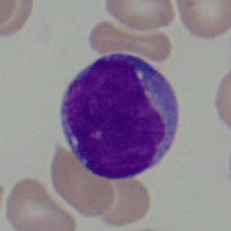
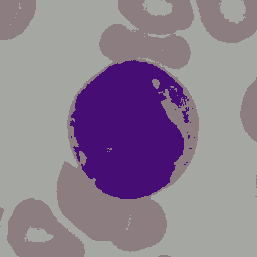
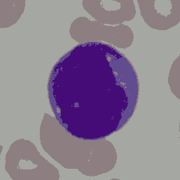
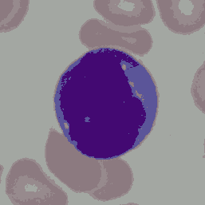

## Acute Lymphoblastic Leukemia Image Segmentation using Memetic Algorithm 

This project is inspired by [Acute lymphoblastic leukemia image segmentation driven by stochastic fractal search](https://link.springer.com/article/10.1007/s11042-019-08417-z) 
paper which introduce a new method for image segmentation with metaheuristic search methods.

Also I used [ALL_IDB2](https://homes.di.unimi.it/scotti/all/) dataset for this project. (Thanks to Prof. Scotti)

|Original | 3 Colors | 4 Colors | 5 Colors |
| -------- |:--------:|:--------:|---------:|
| |  | | |

I contrast with the source paper, I tried to use these 3 search methods. Genetic Algorithm, Simulated Annealing and Memetic Algorithm. As it was expected, Memetic Algorithm
had the best results and lower error among those three, but also, it was the slowest one. Simulated Annealing method was the fastest. I only put the memetic algorithm code here
beacuase I selected it as the main algorithm of my project. The fitness, PSNR and output colors can be found in my [report](./Project/report_persian.pdf) (sorry, the course was in persian 
so I had to write it in persian, but the tables are clear to understand).

For testing my code you should pass the file address and number of clusters you need such as below.

```
> python3 memetic.py ./route/to/image.tiff 5
```

Please install `OpenCV` and `Numpy` before using to prevent dependency errors.

I would appreciate any pull request or comment on my work.

Thank you
